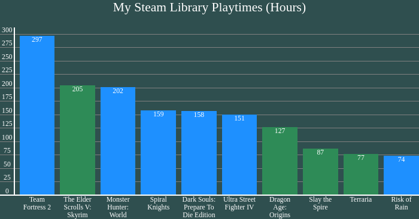
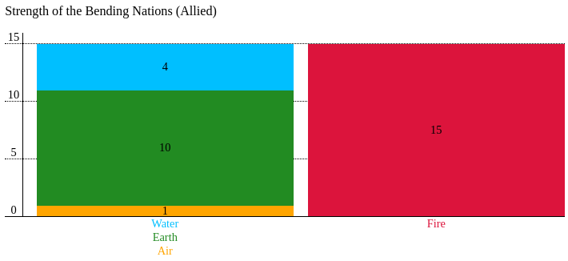

# Quinn's JS Bar Chart Library
Created as a part of Lighthouse Labs' prep course stretch goals, this library allows you to render a series of data as a bar chart on a web page, with various display parameters.

This is my first attempt to seriously work with HTML and CSS to accomplish a particular goal without direct instruction, and it was quite a learning process! There are some things I'd still like to improve, but I'd consider it a success.

 

## How to use

To use, add the `bar-chart.js` script to your web page and call `drawBarChart(data, options, element)`

## Parameters
### Data

The `data` parameter is an array of individual data objects you wish to display as bars in the chart. If you wish to combine multiple data objects into a single bar, include them in a nested array.

#### Data Object Properties
 
|Property Name|Value|Example|Required?|
|--------|----|--|-|
|`value`|`Number` containing the value of the data you wish to display as a bar|`5`|Yes
|`label`|`String` containing a label for this data, which will appear under its bar|`'Pizzas'`|Yes
|`barColor`|`String` containing the CSS color you wish to apply to the bar|`'red'`|No
|`labelColor`|`String` containing the CSS color you wish to apply to the label text|`'brown'`|No

### Options

The `options` parameter is a single object with properties that determine how the whole chart will be rendered.

#### Options Object Properties

|Property Name|Value|Example|Required?|
|-|-|-|-|
|`pixelsPerUnit`|`Number` indicating how many pixels tall a value of `1` will appear on your chart. Determines vertical scale of chart.|`16`|Yes|
|`maxValue`|`Number` indicating the highest value you wish to represent in your chart. With `pixelsPerUnit`, determines total height of the chart.|`50`|Yes|
|`markInterval`|`Number` indicating how many units of value will be marked by each tick along the Y axis. Must be a factor of `maxValue` to render properly.|`5`|Yes|
|`spacing`|`Number` indicating amount of horizontal space between bars on the X axis.|`10`|No|
|`title`|`String` containing title to display above chart.|`'My Cool Chart'`|No|
|`titleSize`|`String` containing CSS font-size to apply to the title.|`'x-large'`|No|
|`titleColor`|`String` containing CSS color to apply to the title.|`'blue'`|No|
|`titleAlign`|`String` indicating CSS text-align to apply to title.|`'center'`|No|
|`barColor`|`String` containing CSS color to apply to any bars that do not define their own color in their data object.|`'grey'`|No|
|`barValueAlign`|`String` indicating where to vertically place value labels within their bars.|`'top'` `'middle'` `'bottom'`|No|
|`labelSize`|`String` containing CSS font-size to apply to bar labels, value labels, and vertical markers.|`'small'`|No|
|`labelColor`|`String` containing CSS color to apply to bar labels, value labels, and vertical markers.|`'black'`|No|
|`axisStyle`|`String` containing CSS border style to apply to X and Y axis lines|`'2px solid black'`|No|
|`ruleStyle`|`String` containing CSS border style to apply to Y axis marker lines.|`'1px dotted black'`|No|
|`animated`|`Bool` indicating whether or not the chart will animate. Clicking on the chart will replay the animation.|`true`|No|

### Element
The `element` parameter represents the DOM element you wish to add the chart to.

## Known Issues

 - If a chart's `maxValue` is not evenly divisible by its `markInterval`, the chart will not render its vertical ticks properly.
 - If `pixelsPerUnit` and `markInterval` are too small, vertical tick labels will overlap and become unreadable
 - While individual bars cannot exceed the maximum height of the chart, multi-bars are not accounted for and can stretch far beyond the chart.
 - The subgrid used to render the horizontal rules in the chart has columns that match the main grid in Firefox but not in Chrome. This does not currently have any negative impact on chart display, but it may cause unforeseen issues.

## Features to be Implemented
- Auto contrast for bar value labels based on bar colour
- Dynamic chart height and value scale instead of using pixels per unit, so it can fit into elements of any height
- More animation options
- Swappable X and Y axes

## Resources Used
- [jQuery API documentation](https://api.jquery.com/)
- [w3schools - jQuery Tutorial](https://www.w3schools.com/jquery/default.asp)
- [w3schools - CSS Reference](https://www.w3schools.com/cssref/default.asp)
- [CSS-Tricks - A Complete Guide to Grid](https://css-tricks.com/snippets/css/complete-guide-grid/)
- [CSS-Tricks - A Complete Guide to Flexbox](https://css-tricks.com/snippets/css/a-guide-to-flexbox/)
- [MDN - Subgrid](https://developer.mozilla.org/en-US/docs/Web/CSS/CSS_Grid_Layout/Subgrid)
- [MDN - Array.isArray()](https://developer.mozilla.org/en-US/docs/Web/JavaScript/Reference/Global_Objects/Array/isArray)
- [stackoverflow - How do I iterate through children elements of a div using jQuery?](https://stackoverflow.com/questions/3024391/how-do-i-iterate-through-children-elements-of-a-div-using-jquery/3024393#3024393)
- [stackoverflow - How do I find out with jQuery if an element is being animated?](https://stackoverflow.com/questions/724911/how-do-i-find-out-with-jquery-if-an-element-is-being-animated)
